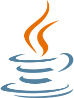

# Aprendiendo Java: Lambda y Streams

¡Bienvenido a mi repositorio de aprendizaje sobre Java!  
En este espacio estoy documentando lo que he aprendido sobre dos características modernas del lenguaje Java: **expresiones lambda** y **la API Stream**. Estas herramientas son fundamentales para escribir código más conciso, legible y funcional en Java.

---

## 🧠 ¿Qué estoy aprendiendo?

### ✅ Expresiones Lambda

Las expresiones lambda permiten representar funciones anónimas (sin nombre) y se utilizan principalmente para implementar métodos funcionales (de interfaces funcionales) de forma más clara.

**Sintaxis básica:**
```java
(parametros) -> { cuerpo }
# lambdas-streams
